# 基于AltStore的自签教程

iOS安装应用程序是需要苹果签名的。企业级开发者账号等可以通过付费(1000+)，才拥有发布App到苹果商店的权限。但是，如果类似模拟游戏，插件等形式的App，因为苹果政策不允许，是拒绝让它们发布到苹果商店的，甚至对应App还可能被封掉，导致安装上的App也无法使用。苹果的严格政策，对于希望安装自己的App的普通用户非常不友好。不幸中的万幸，苹果提供了一个免费的苹果开发者账号，可惜安装的App有效期只有7天。于是AltStore呼之欲出，在App快过期的时候自动帮你重新签名，让用户在几乎无感知的情况下，享受无限期的App使用权。</br>
</br>
本文正是非越狱环境下，基于 AltStore 的自签(用户自己签名App)教程。</br>

## 最低要求
该方案需要在电脑端安装 AltServer ，然后由 AltServer 在手机端安装 Altstore 。电脑端和手机端都有一定要求。</br>
* 手机端：iOS 12.2+
* 电脑端：Windows 10+ 或者 MacOS 10.14.4+

## 准备工作
### 安装最新版的 iTunes
打开网站 [https://www.apple.com.cn/itunes](https://www.apple.com.cn/itunes) ，点击如图所示的「Windows」，点击蓝色的「立即下载适用于 Windows 的 iTunes(64位)」开始下载。注意，千万不要点击「从 Microsoft Store 下载最新版本」，否则后面安装和使用将遇到很多异常。</br>

<span><div style="text-align: center;">
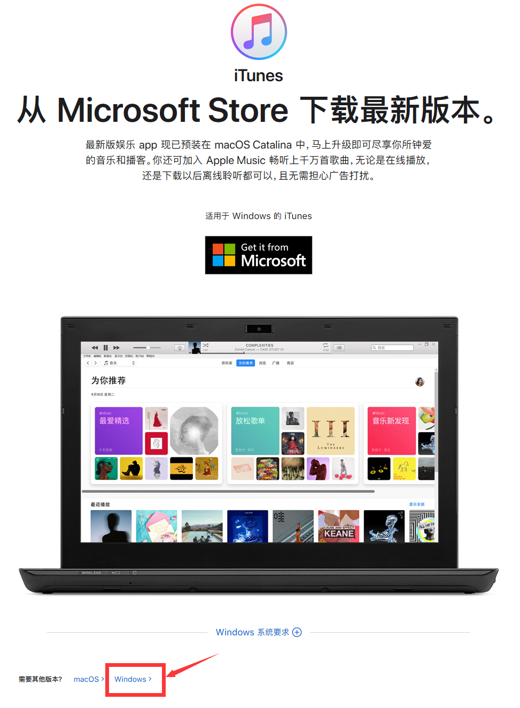
</div></span>

<span><div style="text-align: center;">
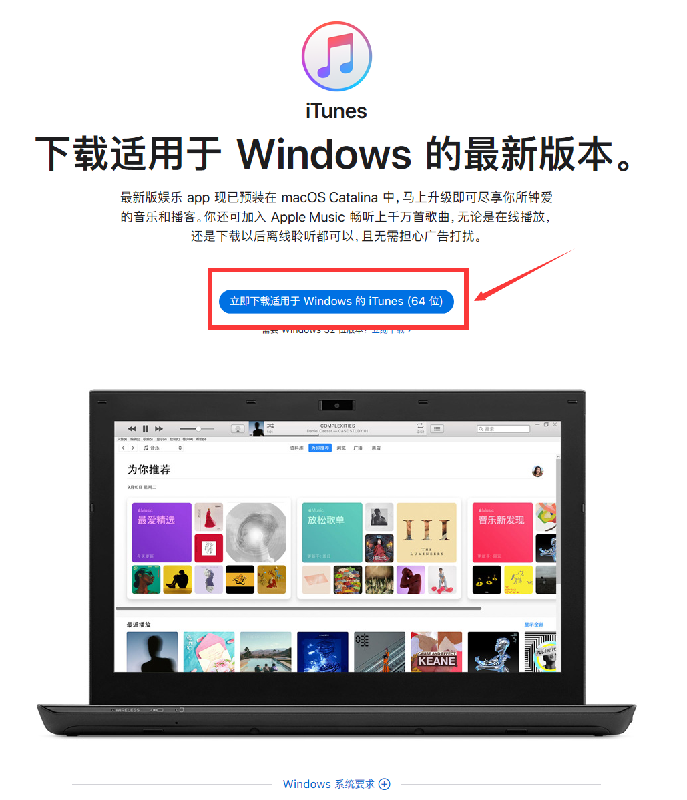
</div></span>

下载完成后，自行根据安装提示进行安装。</br>
安装完成后，需要重启一下你的 Windows 电脑，可以暂时先不重启，等 iCloud 安装完后一起重启。</br>

### 安装最新版的 iCloud
打开网站 [https://support.apple.com/zh-cn/HT204283](https://support.apple.com/zh-cn/HT204283) ，点击如图所示的「Apple 网站上下载 Windows 版 iCloud」开始下载。注意，千万不要点击「从 Microsoft Store 下载 Windows 版 iCloud」，否则后面安装和使用将遇到很多异常。</br>

<span><div style="text-align: center;">
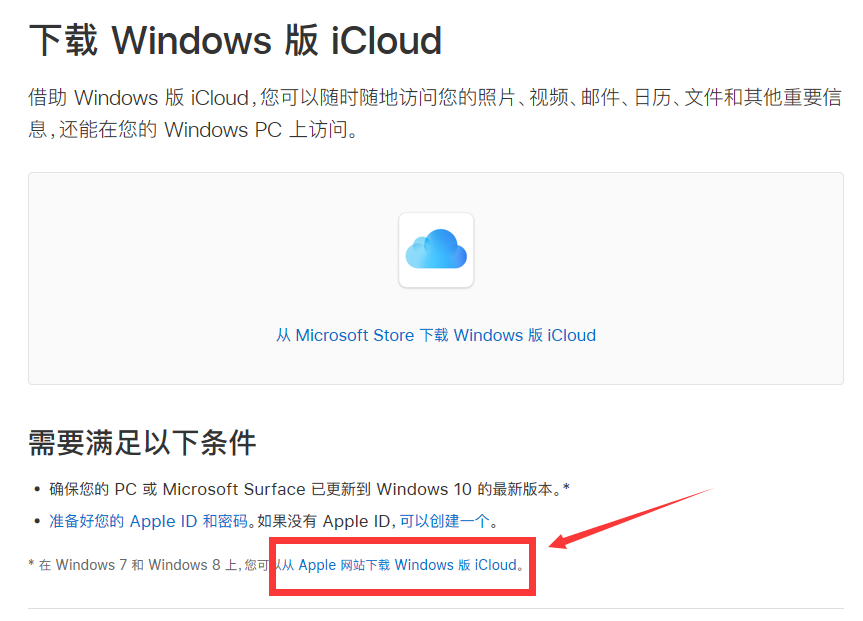
</div></span>

下载完成后，自行根据安装提示进行安装。</br>
安装完成后，需要重启一下你的 Windows 电脑。重启完成后，用你新创建的 Apple ID 登录 iCloud 软件。</br>

<span><div style="text-align: center;">

</div></span>

### 创建新的Apple ID
很多人手机的苹果Apple ID绑定大量的信息，包括支付信息，购买App信息。所以，为了安全起见，强烈建议你重新创建一个新的Apple ID，创建是完全免费的，创建过程也是非常简单的。</br>
创建帮助文档地址：https://support.apple.com/zh-cn/HT204316 </br>
地址里的帮助文档，已经非常详细了。这里不多做介绍。注意，创建的过程中，绝对不需要绑定任何支付信息等，也建议使用一个新的密码。</br>

## 安装 AltStore
### 安装电脑端 AltServer
AltServer 是在电脑端执行的服务程序，支持 Windows 和 MacOS，根据您的电脑类型下载对应的版本。当前假设你的电脑是 Windows 。</br>
打开 AltStore 官方网站 [https://altstore.io](https://altstore.io) ，点击网站主页的「Windows」开始下载 AltServer 的安装包。</br>
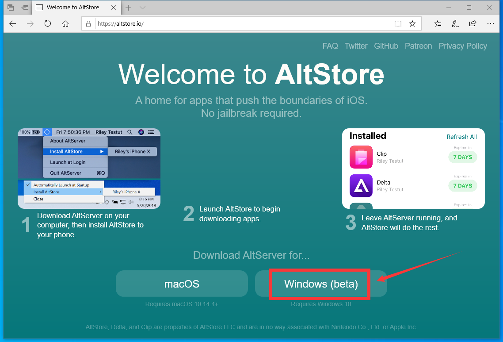</br>
下载完成后，解压并双击「setup」后，根据提示进行安装 AltServer。安装时需要记住自己把软件安装到哪个位置。</br>

<span><div style="text-align: center;">
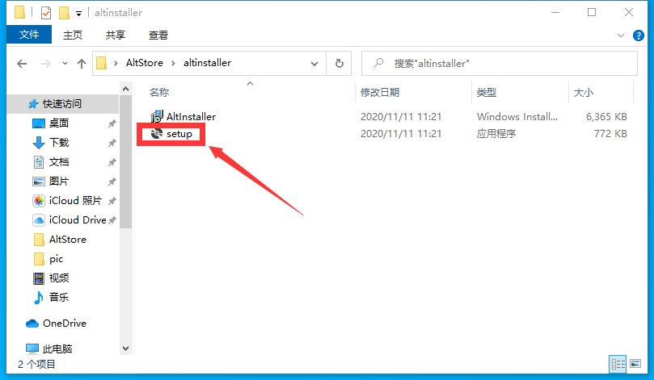
</div></span>

<span><div style="text-align: center;">
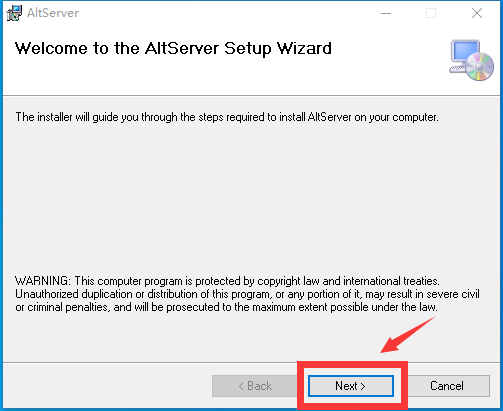
</div></span>

<span><div style="text-align: center;">
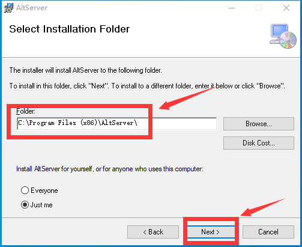
</div></span>

<span><div style="text-align: center;">
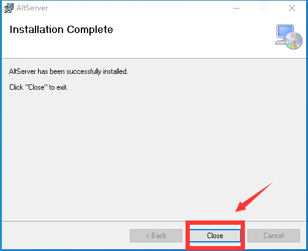
</div></span>

安装完成后，进入安装路径启动 AltServer(必须以管理员身份运行)。当前安装使用的是默认的安装位置。</br>

<span><div style="text-align: center;">
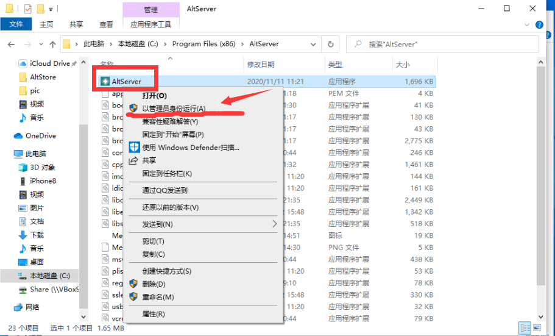
</div></span>

启动完成后，AltServer 会显示在系统通知托盘中，如图：</br>

<span><div style="text-align: center;">
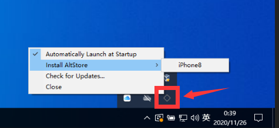
</div></span>

到此为止，AltServer 已经安装成功，理论上可以安装 AltStore 了。但是我们不得不面对略显悲哀的情况，尝试安装 AltStore 会可能会提示：</br>
```
(SSL Error: WINHTTP_CALLBACK_STATUS_FLAG_CERT_REV_FAILED failed to check revocation status.)
```
如果你生活在正常上网的环境，或者熟悉科学上网...请跳过下面这部分，直接看"安装手机端 AltStore"。但是如果肉身还在大陆的话，建议你还是正常往下看。</br>
</br>
这个提示产生的原因：AltStore 是通过 AltServer 程序内部去下载然后安装的。AltStore 这个软件是美国小哥写的，安装文件放在国外，而我们生活在大陆...你懂的，很多国外网站莫名其妙要不访问不了，要不就访问不正常。所以我们必须得换一个思路，直接把需要安装的 AltStore 下载到本机电脑(其实可以放到局域网内任何一台电脑)，然后在电脑里搭建了一个简易 "Http Web Server" ，最后把 AltServer 下载地址指向这个我们更换过的地址即可。这个方案需要使用额外两个程序：HFS，AltServerPatcher, </br>
</br>
我们先安装 HFS。HFS 项目地址：[https://sourceforge.net/projects/hfs](https://sourceforge.net)。</br>
这里我们已经提前给你下载准备好了。直接点击目录下的 "hfs.exe"，运行如下：</br>

<span><div style="text-align: center;">
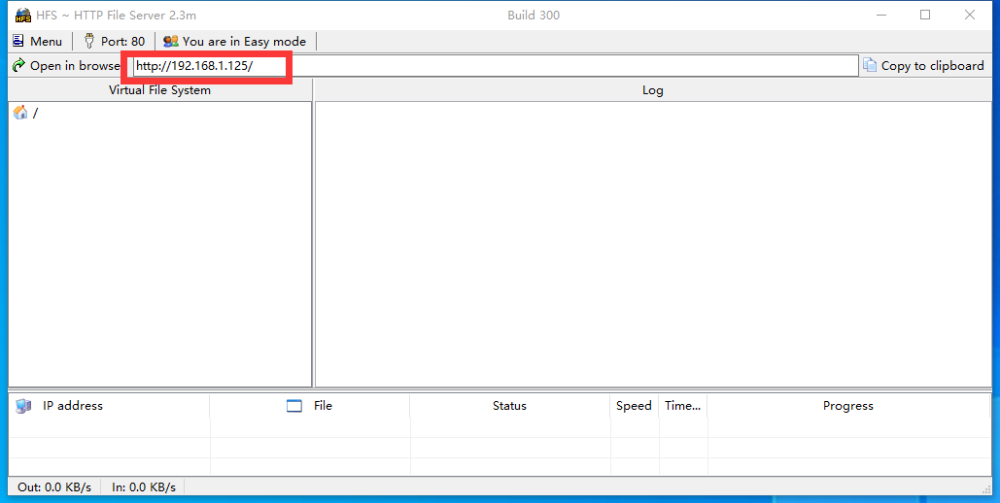
</div></span>

红色框里的地址，其实就是你的局域网地址。</br>
然后我们再去下载最新的 AltStore.ipa，地址为: [https://f000.backblazeb2.com/file/altstore/altstore.ipa](https://f000.backblazeb2.com/file/altstore/altstore.ipa) 。</br>
安装 AltStore 的时候，你最好使用电脑浏览器根据上面链接去下载一次这个 altstore.ipa ，获取到最新的版本，然后覆盖文档里提供的相同文件，毕竟，文档里的 AltStore.ipa 可能因为得不到及时更新，变得过旧。</br>
我们获取得到最新的 altstore.ipa 后，使用刚才的 HFS 程序打开它，直接用鼠标把 altstore.ipa 拖到 HFS 左边框「Virual File System」即可，如下图：</br>

<span><div style="text-align: center;">
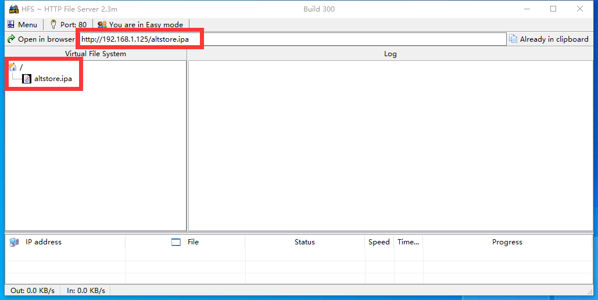
</div></span>

你也将获得类似如下一个地址: http://YOUR_IP/altstore.ipa 。因为我的局域网地址是 192.168.1.125 ，所以，最后实际地址为 http://192.168.1.125/altstore.ipa 。请观察上图里的地址栏。</br>
</br>
接下来就要给 AltServer 打补丁，让 altstore.ipa 的下载地址实际指向刚才我们在 HFS 上提供的局域网地址。我们需要再安装 AltServerPatcher 。AltServerPatcher 的项目地址：[AltServer Patcher - Patch AltServer to Sideload Any IPA](https://www.reddit.com/r/jailbreak/comments/f1j55e/update_altserver_patcher_patch_altserver_to/) 。这里我们已经提前给你下载准备好了。执行 AltServerPatcher 目录下的 AltServerPatcher (必须以管理员身份运行)。</br>

<span><div style="text-align: center;">
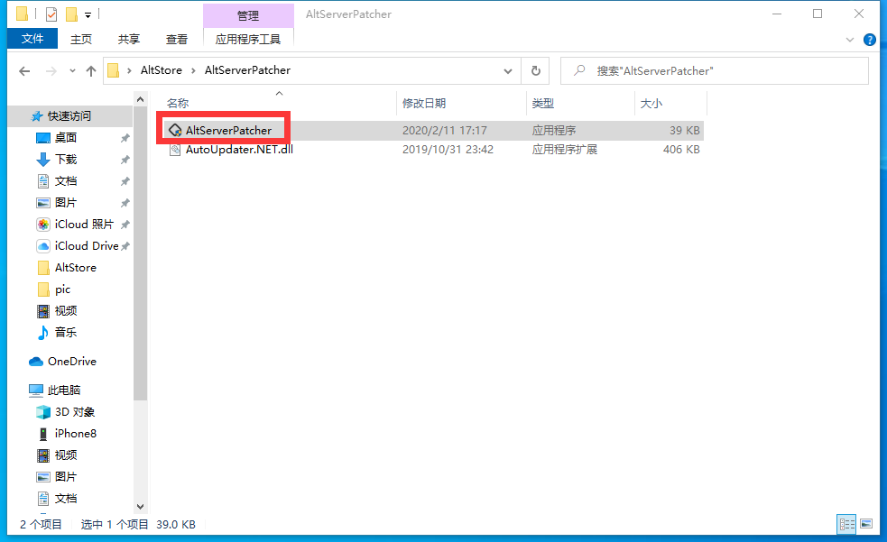
</div></span>

<span><div style="text-align: center;">
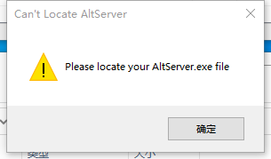
</div></span>

提示让你选择 AltServer 安装目录。此时根据提示选择你安装的目录，默认："C:\Program Files (x86)\AltServer" ，最后点击「打开」。</br>

<span><div style="text-align: center;">
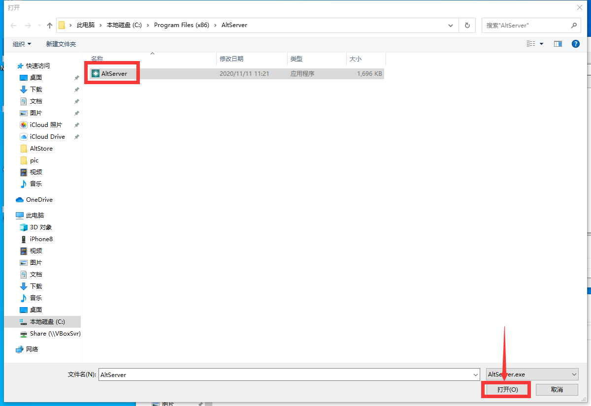
</div></span>

接下来，在 AltServerPatcher 程序里，「Select App:」选择 「Custom URL」，然后把 「Enter URL:」 原来的地址删除，换上 HFS 里的地址，类似当前例子的地址 http://192.168.1.125/altstore.ipa ，最后点击 「Patch」，这就简单的把地址更换了。</br>

<span><div style="text-align: center;">
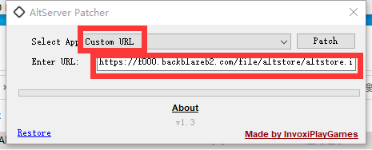
</div></span>

<span><div style="text-align: center;">
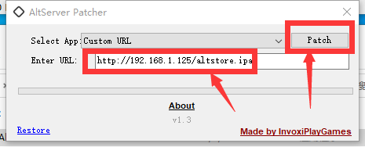
</div></span>

<span><div style="text-align: center;">
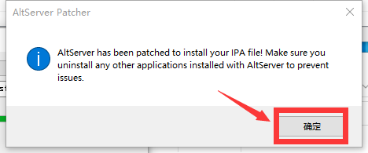
</div></span>

</br>
补充一下：如果你希望 AltServer 恢复原来的地址，点击下图的 「Restore」恢复按钮。不过只是希望在手机上安装你的App，不恢复并不影响后续操作。</br>

<span><div style="text-align: center;">
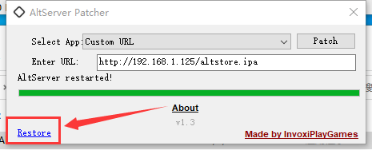
</div></span>

### 安装手机端 AltStore

如果当前 AltServer 未在系统通知托盘显示，那么进入对应安装目录重新运行 AltServer (必须以管理员身份运行)。</br>
打开 iTunes 并把 iPhone 通过数据线连接到电脑。注意：数据线只需要在安装 AltStore 时接上，一旦 AltStore 已经成功安装，后面完全可以通过 WiFI 安装APP，不再需要数据线。</br>
数据线接上后，如果在 iPhone 上有弹框，点击「信任」。点击手机图标进入手机详细页面。</br>

<span><div style="text-align: center;">
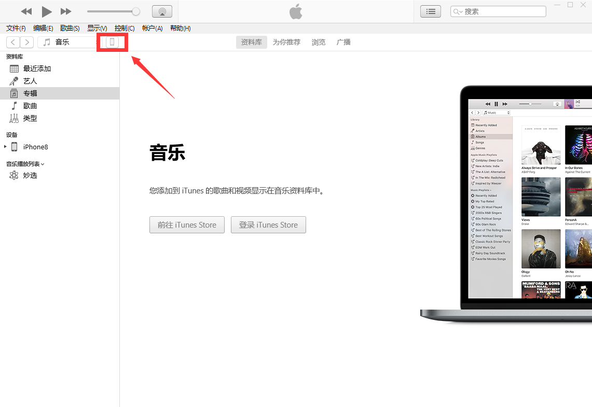
</div></span>

在「选项」区域中，勾选「通过 Wi-Fi 与此 iPhone 同步」</br>

<span><div style="text-align: center;">
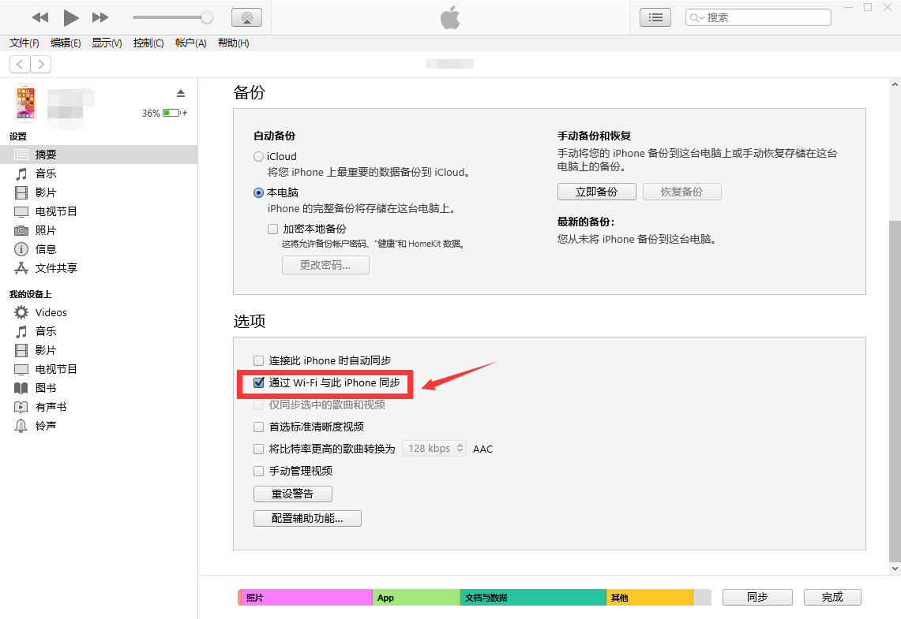
</div></span>

这时候点击系统通知托盘中的 AltStore ，点击「Install AltStore」选择你的 iPhone 设备。</br>

<span><div style="text-align: center;">

</div></span>

这时，需要输入你新创建的 Apple ID 和密码，点击「Install」开始把 AltStore 安装到 iPhone 中。</br>

<span><div style="text-align: center;">
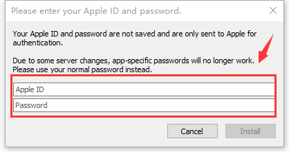
</div></span>

提示 AltStore 可能已经在别的设备安装过(曾经更换手机安装过)，那么之前的手机的App将会停止工作，问你是否继续。选择「确定」。

<span><div style="text-align: center;">
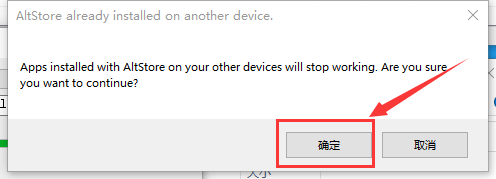
</div></span>

稍等片刻，在 iPhone 桌面就可以看到 AltStore 应用了。但是当你点击的该应用的时候可能会提醒你「不受信任的开发者」 。</br>

<span><div style="text-align: center;">
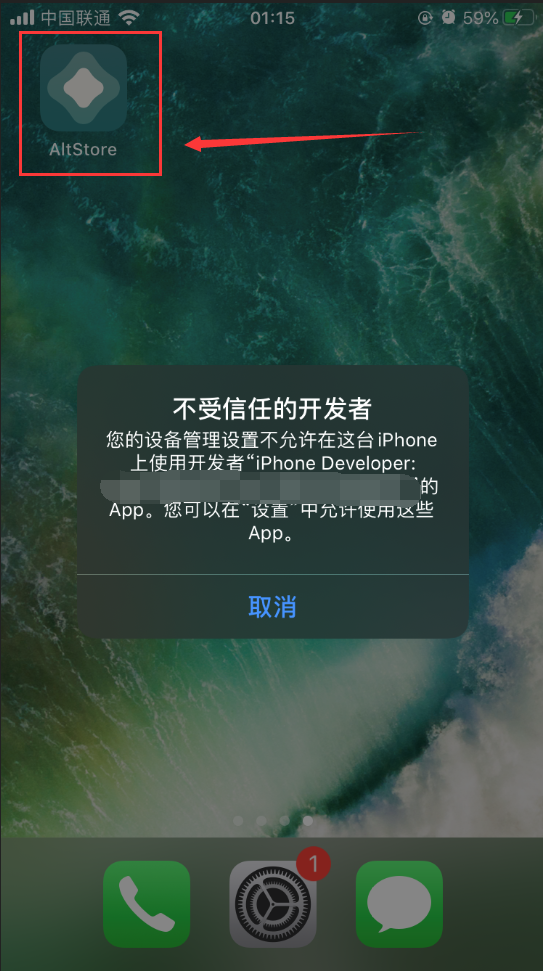
</div></span>

需要到你手机的「设置->通用->设备管理->开发者APP」。进入对应你Apple账号的选项，点击里面的「信任」按钮。点击信任后，AltStore App 就可以打开了。</br>

<span><div style="text-align: center;">
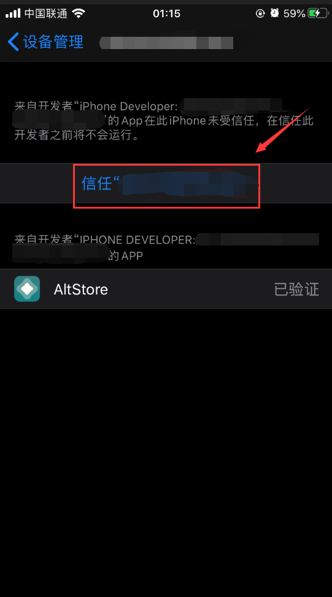
</div></span>

<span><div style="text-align: center;">
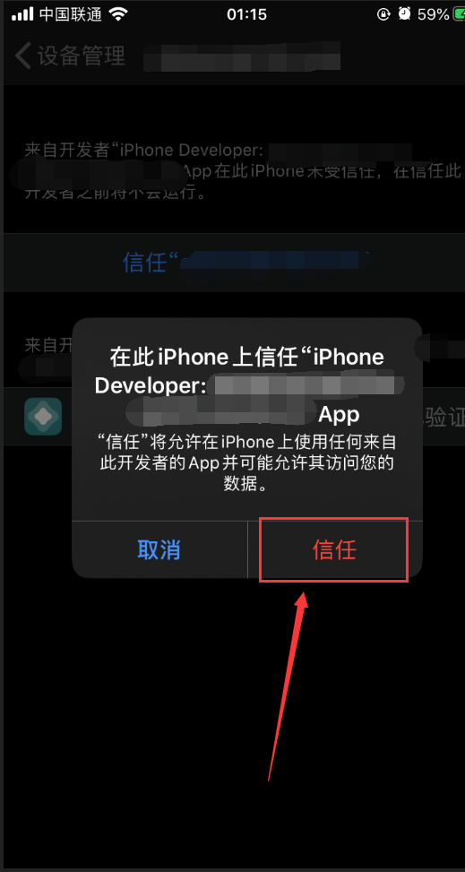
</div></span>

## 安装您的App

到此为止，你就可以通过 AltStore 在手机上安装任意的 App了。我们选越狱 App 的 unc0ver 为例子，当然安装你的 App 时，步骤是一致的，只是把 unc0ver 换成你自己的就行。</br>

安装 App 的时候，需要先把 App对应的安装 ipa 文件(App安装包，文件名后缀为 ".ipa" )传到手机系统可以直接访问的地方。比如放在百度网盘文件夹里，或者通过QQ-"我的电脑"功能，把电脑的 ipa 文件传到手机QQ里。当前我们以百度网盘为例。</br>
先把 unc0ver.ipa 这个安装包放到百度网盘某一个文件夹里，然后点击该文件，会弹出下面提示框，选择 「用其他应用打开」。</br>

<span><div style="text-align: center;">
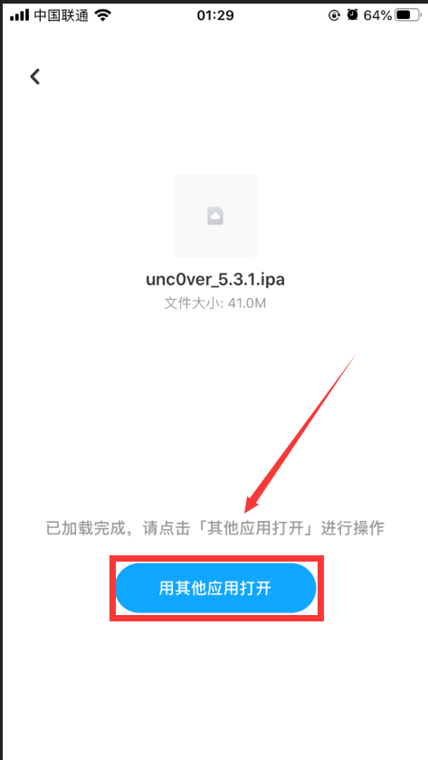
</div></span>

选择「拷贝到AltStore」，会自动跳转到 AltStore 打开这个文件。

<span><div style="text-align: center;">
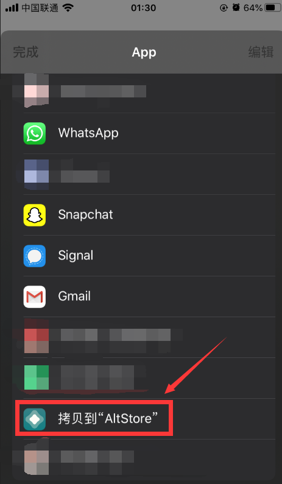
</div></span>

这时候，会弹出需要登陆 AltStore 的输入框，输入你新创建的 Apple 账号和密码。这里使用你的账号和密码的作用：AltStore 使用它来跟苹果通信，然后帮助你签名安装App。</br>

<span><div style="text-align: center;">

</div></span>

用户密码输入正确后，AltStore就会自动安装复制过来的 ipa 文件。注意，安装 ipa 过程需要电脑端同时运行着 "iClond(需处于登陆状态) + iTunes + AltServer", 并与 iPhone 处于同一个 Wi-Fi 下，要不然会报错并无法完成安装。下图红色框里显示的是安装进度条。</br>

<span><div style="text-align: center;">
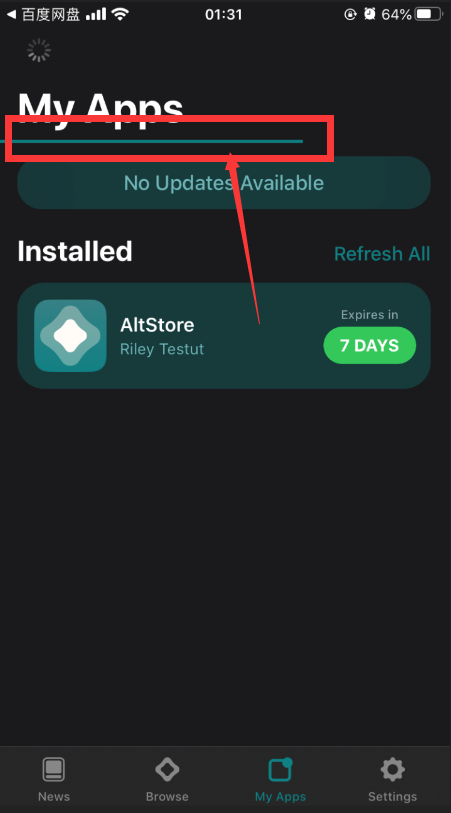
</div></span>

安装成功后你的 App 将会出现在下方「Installed」列表中，见下图下面那个红色框。还有「SideLoaded」副标题，意思就是"这个 App 是你自己在设备上手动安装的应用"。另外每个安装的 App 右边有「Expires in」XXX DAYS 的提示，意思是这个 App 将在 XXX 天后将过期。当然不用担心，后面会讲到如何续签，避免 App 过期。</br>

<span><div style="text-align: center;">
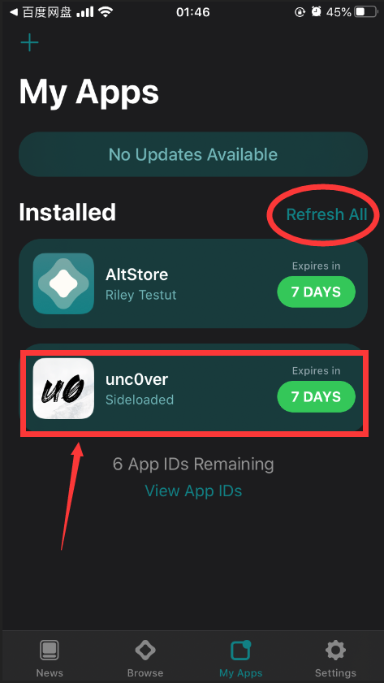
</div></span>

回到手机桌面，你将看到 ipa 已经显示在手机屏幕上，现在就可以正常使用它了。</br>

<span><div style="text-align: center;">
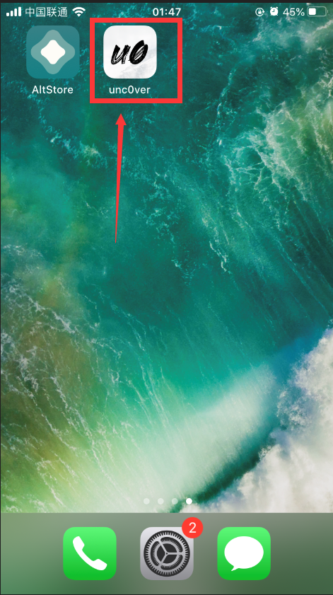
</div></span>

！！！最后，特别需要声明的是！！！</br>
</br>
如何续期：</br>
每个自签的 ipa 是只有 7 天有效期的，如果需要续期，需要电脑端同时运行着 "iClond(需处于登陆状态) + iTunes + AltServer"， 并与 iPhone 处于同一个 Wi-Fi 的环境下。理论上 AltStore 会自动帮你续签，但是为了保险起见，你最好还是每隔两三天打开 AltStore，手工点击 AltStore 中的「Refresh All」来续签全部自签应用。「Refresh All」是下图上面那个红色区域，点击它保证「Expires in」的天数(剩余有效天数)大于 0。</br>

<span><div style="text-align: center;">

</div></span>

</br>忘记续期：</br>
点击 App 会闪退，可能是你的 App 忘记了 7 天内续期。解决：先删除 App，按照上面步骤重新安装一次你的 App 即可。</br>
点击 AltStore 也闪退，可能是 AltStore 本身也忘记了 7 天内续期。解决：先删除 AltStore，按照上面步骤再安装一次 AltStore，其余 App 也要重新安装一次。</br>

## 写在最后
本次的应用自签教程就写到这里，如果你在操作过程中出现错误，不妨试试跟着教程多试几次，也可以进入网站 [https://altstore.io/faq](https://altstore.io/faq) 查看相关的问题说明。</br>
提示：[https://altstore.io/faq] 网站是英文的，你可以通过网页的翻译功能翻译成中文，翻译后的内容阅读应该不成问题。

## 参考资料
* [基于 AltStore 的越狱工具自签教程｜全网最详细](https://zhuanlan.zhihu.com/p/143936759)
* [unc0ver自签工具——AltStore安装教程](https://www.bilibili.com/video/av88917820)
* [用Altstore安装uncover给iPhone越狱，各种报错？最完整攻略助你越狱，无视掉签!](https://www.bilibili.com/video/BV1kV411C7b9)
* [https://altstore.io/faq](https://altstore.io/faq)
